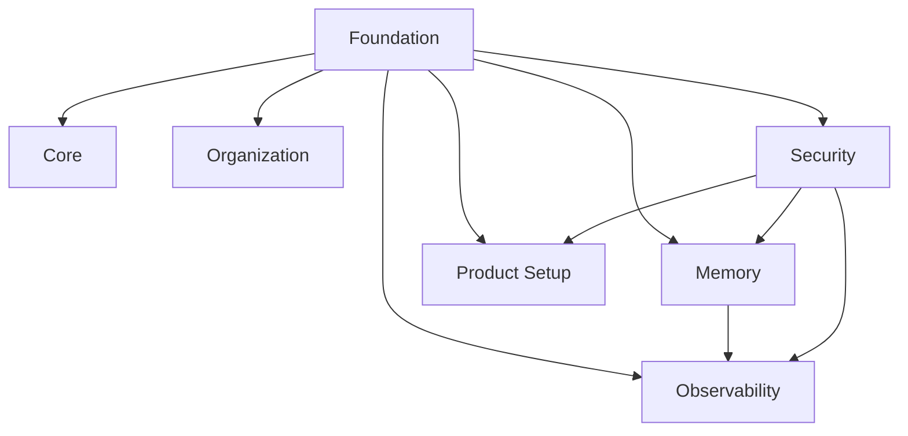

# PAOS Documentation

This directory contains the current planning baseline for PAOS. It captures the parts of the system that have already been discussed and narrowed into stable decisions.

## Documentation Map

| Domain | Purpose | Status |
| --- | --- | --- |
| [Foundation](foundation/README.md) | Baseline product, system, and governance design | Planned |
| [Foundation / Core](foundation/core/README.md) | Product stance, CEO/COO model, and AI identity | Planned |
| [Foundation / Organization](foundation/organization/README.md) | Backbone roles, hierarchy, and company structure | Planned |
| [Foundation / Memory](foundation/memory/README.md) | Memory, continuity, working state, governance, and retention | Planned |
| [Foundation / Observability](foundation/observability/README.md) | Logs, audit history, and traceability rules | Planned |
| [Foundation / Security](foundation/security/README.md) | Permission and sandbox foundation rules | Planned |
| [Foundation / Product Setup](foundation/product-setup/README.md) | First-run setup and early empire configuration | Planned |
| [Planning Status](planning-status.md) | What is done and what still needs design work | Active |

## Foundation At A Glance

## Reading Order
1. Start with [Foundation](foundation/README.md).
2. Read [Operating Model](foundation/core/operating-model.md).
3. Continue to [Role Hierarchy](foundation/organization/role-hierarchy.md).
4. Read the memory set through [Memory](foundation/memory/README.md).
5. Continue to [Log Model](foundation/observability/log-model.md).
6. Continue to [Onboarding Baseline](foundation/product-setup/onboarding-baseline.md).
7. Use [Planning Status](planning-status.md) to see what still needs specification before implementation starts.
