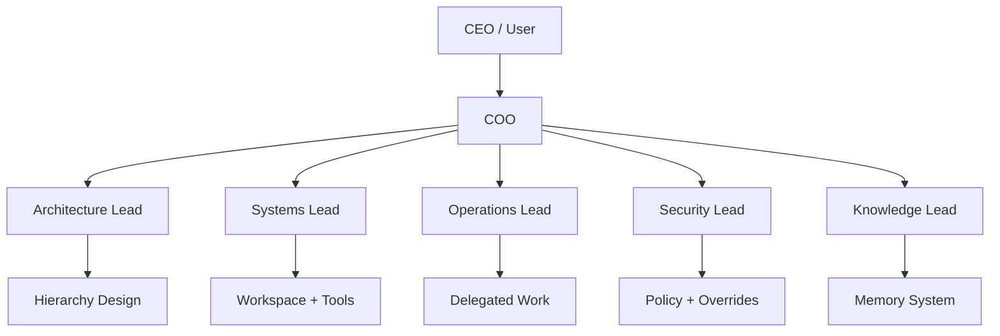

# PAOS Documentation

This directory contains the current planning baseline for PAOS. It captures the parts of the system that have already been discussed and narrowed into stable decisions.

## Documentation Map

| Area | Purpose | Status |
| --- | --- | --- |
| [Foundation / Operating Model](foundation/operating-model.md) | CEO, COO, built-in AI identity model, and core product stance | Planned |
| [Foundation / Role Hierarchy](foundation/role-hierarchy.md) | Fixed backbone roles, ladder, and branching rules | Planned |
| [Foundation / Memory Model](foundation/memory-model.md) | Memory layers, logs boundary, and durable memory flow | Planned |
| [Foundation / Session Continuity](foundation/session-continuity.md) | Context overflow behavior and structured handoff rules | Planned |
| [Foundation / Working State Schema](foundation/working-state-schema.md) | Typed session state and handoff object design | Planned |
| [Foundation / Memory Governance](foundation/memory-governance.md) | Memory access, commit authority, and overrides | Planned |
| [Foundation / Memory Retention](foundation/memory-retention.md) | Superseding, archiving, purging, and retrieval behavior | Planned |
| [Planning Status](planning-status.md) | What is done and what still needs design work | Active |

## Foundation At A Glance

## Reading Order
1. Start with [Operating Model](foundation/operating-model.md).
2. Continue to [Role Hierarchy](foundation/role-hierarchy.md).
3. Read the memory set in this order:
   [Memory Model](foundation/memory-model.md),
   [Session Continuity](foundation/session-continuity.md),
   [Working State Schema](foundation/working-state-schema.md),
   [Memory Governance](foundation/memory-governance.md),
   [Memory Retention](foundation/memory-retention.md).
4. Use [Planning Status](planning-status.md) to see what still needs specification before implementation starts.
