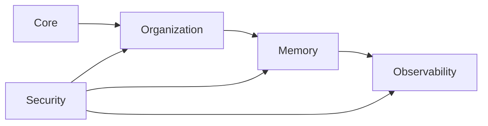

# Foundation Documentation

This section defines the baseline structure of PAOS before implementation starts. It is grouped by domain so new sections can grow without flattening the whole foundation into one long list.

## Domain Map

| Domain | Purpose | Status |
| --- | --- | --- |
| [Core](core/README.md) | Product stance, identity model, and baseline operating rules | Planned |
| [Organization](organization/README.md) | Built-in hierarchy, titles, and structure rules | Planned |
| [Memory](memory/README.md) | Memory, continuity, working state, governance, and retention | Planned |
| [Observability](observability/README.md) | Logs, audit history, and traceability rules | Planned |
| [Security](security/README.md) | Permission model, sandboxing, and protection boundaries | In progress |

## Foundation Domains

## Reading Order
1. [Core](core/operating-model.md)
2. [Organization](organization/role-hierarchy.md)
3. [Memory](memory/README.md)
4. [Observability](observability/log-model.md)
5. [Security](security/README.md)
