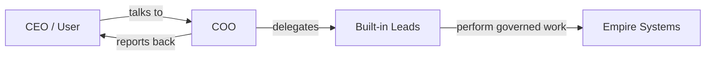

# Operating Model

This document defines the baseline operating stance for PAOS before implementation begins.

## Core Position

- PAOS is a **cross-platform desktop application** from the start.
- The user is the **CEO** of the empire.
- The **COO** is the only primary conversational interface in the baseline.
- Internal work may be delegated by the COO to built-in leads and future custom agents.
- Built-in AIs are part of the product baseline and cannot have their system role replaced by the user.

## AI Identity Model

Every AI instance in PAOS should carry four identity fields:

| Field | Purpose | Mutability |
| --- | --- | --- |
| `role_id` | Immutable system identity used by policy and orchestration | Fixed |
| `title` | Visible company title in the org chart | Fixed for built-ins |
| `name` | Personal name chosen by the CEO | Editable |
| `description` | Short identity and behavior note | Editable |

## Interaction Model

## Baseline Rules

- The CEO should always be able to inspect the structure of the empire.
- The COO remains the front door even when work is delegated internally.
- Built-in roles form the safe baseline that future customization grows from.
- Future custom agents should plug into the hierarchy rather than bypass it.
- Security and memory are treated as first-class system concerns, not side features.

## Why This Matters

This model keeps PAOS understandable:
- the user knows who they are in the system,
- the user knows who they talk to,
- and the rest of the organization can expand without turning the product into an unstructured agent swarm.
