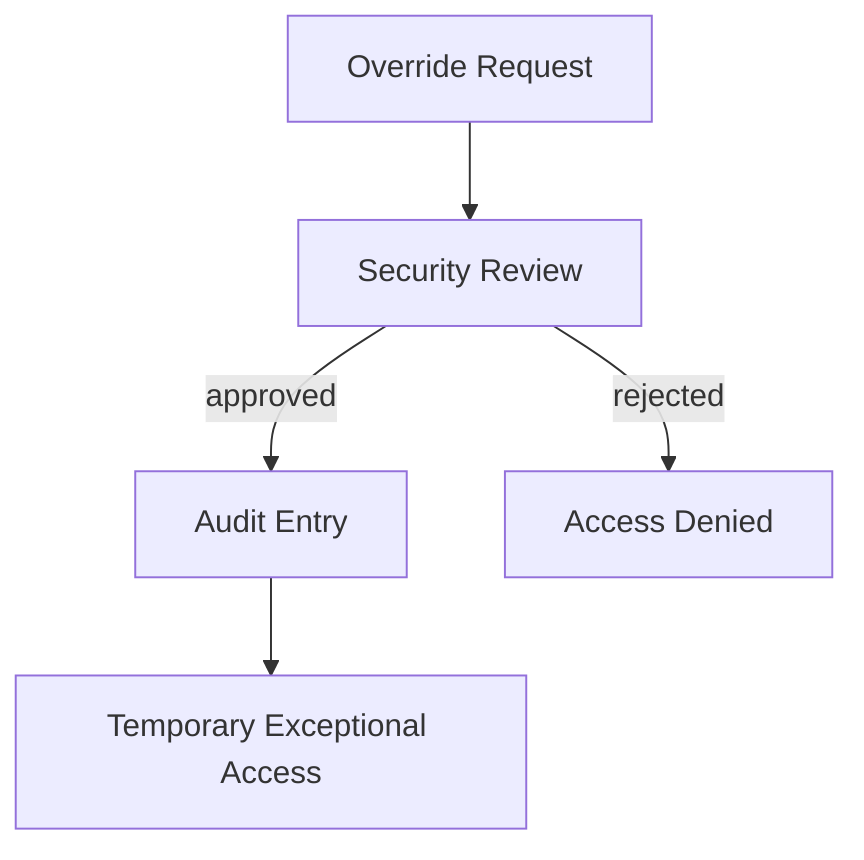

# Memory Governance

This document defines who can read memory, who can propose memory changes, and how exceptional access works.

## Read Defaults

| Memory layer | Default readers |
| --- | --- |
| `Empire memory` | All built-in roles through policy-filtered retrieval |
| `Project/workspace memory` | COO and roles attached to the project |
| `Role memory` | The role itself, COO, Knowledge Lead, Security Lead |
| `Session memory` | Active session participants and orchestration logic |

The CEO should have full direct read access across the memory system.

## Write And Commit Defaults

| Memory layer | Proposal origin | Shaping | Approval |
| --- | --- | --- | --- |
| `Empire memory` | COO or authorized originator | Knowledge Lead | Security Lead |
| `Project/workspace memory` | Assigned roles on the project | Knowledge Lead | Security Lead |
| `Role memory` | The role itself | Knowledge Lead | Security Lead |

## Commit Flow

## Sharing Rules

- Cross-role and cross-branch memory access is denied by default.
- Sharing should require an approved link or policy path.
- The COO can coordinate across branches, but should not silently erase the boundary model.

## Override Model

Exceptional access to otherwise private memory should use a **Security-gated override with audit**.

## Governance Principles

- Knowledge Lead owns memory quality and retrieval.
- Security Lead owns permission to commit, override, and inspect under policy.
- The CEO should be able to inspect memory directly even when internal roles cannot.
- Memory access should remain explainable, not magical.
