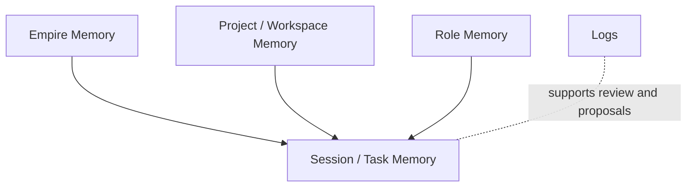

# Memory Model

This document defines how PAOS should think about memory before storage and implementation details are chosen.

## Core Separation

PAOS should treat these as separate systems:

- **Session memory**: finite working context for active work
- **Logs**: immutable records of what happened
- **Long-term memory**: curated durable knowledge

Logs are not memory. Long-term memory is not a transcript dump.

## Memory Layers

| Layer | Purpose |
| --- | --- |
| `Empire memory` | Global rules, identity, structure, and durable preferences |
| `Project/workspace memory` | Project decisions, goals, constraints, and shared working context |
| `Role memory` | Role-specific methods, patterns, and role-local notes |
| `Session/task memory` | Temporary working state for the current context window |

## Memory Stack



## Durable Memory Flow

The baseline durable-memory path is:

```text
originator -> Knowledge Lead shapes proposal -> Security Lead approves -> commit
```

This separates memory quality from memory permission.

## Recall Model

PAOS should use **targeted retrieval** instead of loading everything into context.

When the COO begins work, the system should retrieve only the most relevant memory items based on:
- current project or workspace
- active role involvement
- task goal
- active constraints
- prior accepted decisions

## Design Principles

- Role memory is isolated by default.
- Memory proposals should be created from durable material such as decisions, rules, and preferences.
- Temporary work state should not be promoted into long-term memory just because the session is large.
- Memory should use a **hybrid format**:
  structured records for retrieval and policy,
  compact readable summaries for transparency.
