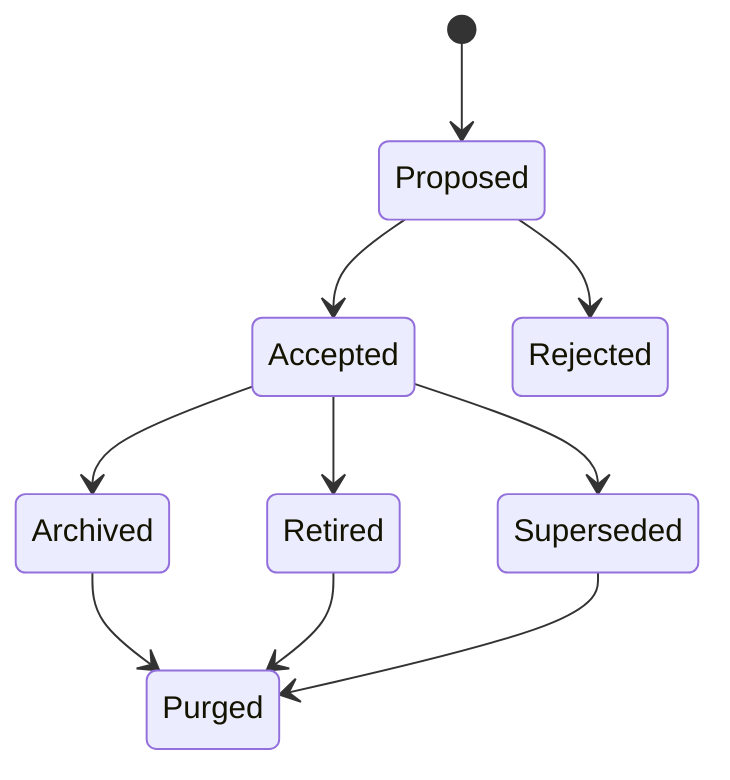

# Memory Retention

This document defines how committed memory changes over time and how forgetting should work.

## Baseline Retention Rules

- Committed memory should be **superseded, not silently rewritten**.
- Long-term memory should have **no silent expiry**.
- Archived, retired, or superseded items should be **excluded from normal retrieval by default**.
- Normal removal should be **archive first**.
- Permanent purge should require an explicit **CEO-directed** action.
- Purging long-term memory should **not** automatically purge logs.

## Lifecycle



## Authority

The default governance pattern for archival, retirement, and superseding is:

```text
Knowledge Lead proposes -> Security Lead approves -> CEO may explicitly direct
```

## Retrieval Behavior

| State | Normal retrieval | Historical review |
| --- | --- | --- |
| `Accepted` | Included | Included |
| `Superseded` | Excluded by default | Included |
| `Archived` | Excluded by default | Included |
| `Retired` | Excluded by default | Included |
| `Rejected` | Excluded | Included through trace history |

## Purge Model

Purge is a stronger act than archive:

- `archive` removes the item from active operating use
- `purge` removes the durable memory record itself from memory stores
- logs remain separate unless the CEO performs a distinct log-deletion action later

## Why This Matters

These rules preserve two things at once:
- the empire can evolve without corrupting its own memory trail
- the CEO still has a deliberate path to make the system forget something when needed
