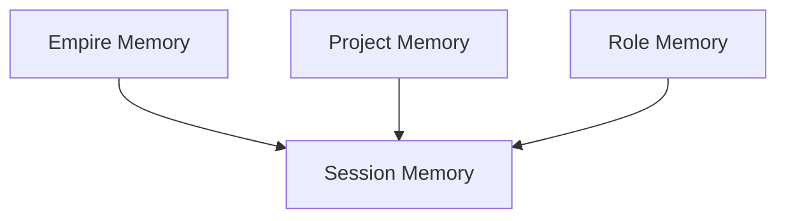

# Memory

This domain defines how PAOS remembers, carries context forward, governs memory access, and changes durable memory over time.

## Documents

| Document | Purpose | Status |
| --- | --- | --- |
| [Memory Model](memory-model.md) | Memory layers, logs boundary, and durable memory flow | Planned |
| [Session Continuity](session-continuity.md) | Context rollover and checkpoint behavior | Planned |
| [Working State Schema](working-state-schema.md) | Typed session state and handoff structure | Planned |
| [Memory Governance](memory-governance.md) | Read/write authority, sharing, and overrides | Planned |
| [Memory Retention](memory-retention.md) | Superseding, archiving, and purge behavior | Planned |

## Memory Stack

