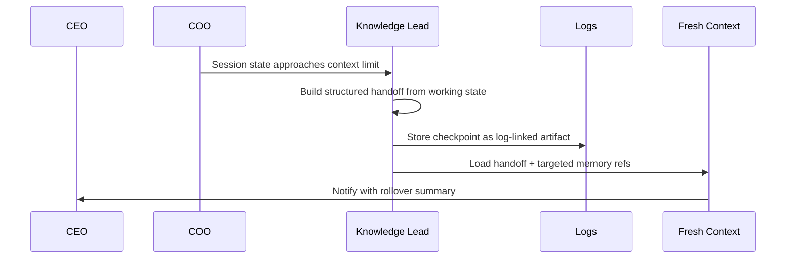

# Session Continuity

This document defines how PAOS should survive token pressure and context overflow without losing continuity.

## Goal

Context overflow should be treated as a normal operating condition, not as a failure mode.

## Baseline Strategy

- Maintain a **continuous working state** during the session.
- Near context limits, produce a **structured handoff**.
- Start a **fresh context automatically**.
- Notify the CEO with a compact rollover summary.
- Keep the raw transcript in logs and avoid dragging large transcript slices forward by default.

## Rollover Sequence

## What The Handoff Is

The handoff is not a transcript summary of whatever happened last.

It is the minimum reliable operating package needed for the next context to continue correctly:
- current goal
- active decisions
- constraints
- open questions
- pending actions
- relevant references

## Checkpoint Rules

- Checkpoints should be stored as **log-linked artifacts**.
- Checkpoints should not be auto-promoted into long-term memory.
- A rollover should happen automatically once a valid handoff exists.
- The CEO should be informed that rollover happened, but should not need to approve normal rollover every time.

## Promotion Rule

Only durable items such as accepted decisions, policies, and preferences should become long-term memory proposals. A checkpoint itself is a continuity artifact, not long-term memory.
