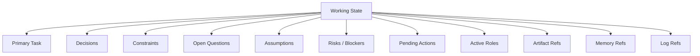

# Working State Schema

This document defines the typed session state that powers rollover, continuity, and controlled delegation.

## Baseline Shape

The working state should track one primary task and its current operating picture.

## Top-Level Fields

| Field | Purpose |
| --- | --- |
| `session_id` | Current session identifier |
| `project_id` / `workspace_id` | Current project or workspace context |
| `handoff_id` | Identifier for a generated rollover package |
| `created_at`, `updated_at` | Session state timestamps |
| `executive_summary` | Compact readable summary for quick orientation |
| `primary_task` | Main objective and success condition |
| `current_status` | Current lifecycle state |
| `decisions[]` | Accepted or proposed decisions |
| `constraints[]` | Active rules, limits, and boundaries |
| `open_questions[]` | Unresolved issues |
| `assumptions[]` | Current working assumptions |
| `risks_or_blockers[]` | Known threats to progress |
| `pending_actions[]` | Assigned work that remains open |
| `active_roles[]` | Roles involved in the session |
| `artifact_refs[]` | Files, folders, outputs, and outside references |
| `memory_refs[]` | Retrieved memory items used in this context |
| `log_refs[]` | Links back to raw events and transcript history |

## State Layout

## Record Design Rules

- Typed fields are authoritative.
- `executive_summary` exists for fast orientation, not as the source of truth.
- Provenance should be **per item**, not just per section.
- Status values should be explicit rather than buried in prose.

## Core Record Families

### Decision record
- formal statement
- rationale
- typed scope
- lifecycle status
- originator
- approver
- supersedes link when needed
- source refs

### Pending action record
- one responsible owner
- optional collaborators
- explicit status and priority
- dependencies
- blockers
- optional due date
- linked artifacts, memory refs, and source refs

### Reference records
- `artifact_ref` for files, folders, outputs, and approved outside resources
- `memory_ref` for durable memory retrieved into context
- `blocker_ref` for typed blockers with severity, owner, and resolution state
- `source_ref` for typed provenance without copying large excerpts into the handoff

## Operating Benefit

This schema keeps PAOS from relying on vague summaries. It lets the system roll over sessions, preserve accountability, and reconstruct why a state exists.
