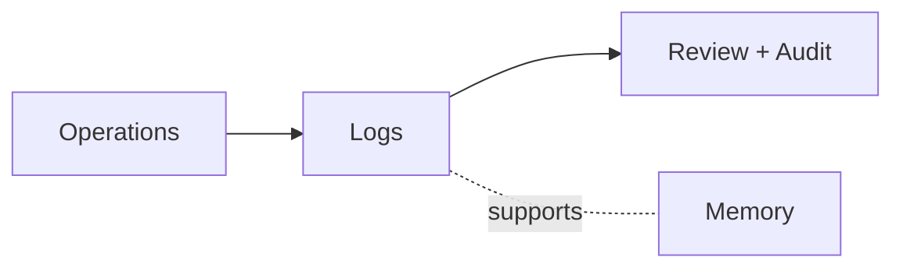

# Observability

This domain defines how PAOS keeps ground-truth history for audit, review, reconstruction, and continuity without confusing logs with long-term memory.

## Documents

| Document | Purpose | Status |
| --- | --- | --- |
| [Log Model](log-model.md) | Log streams, event families, access, and retention rules | Planned |

## Observability View

