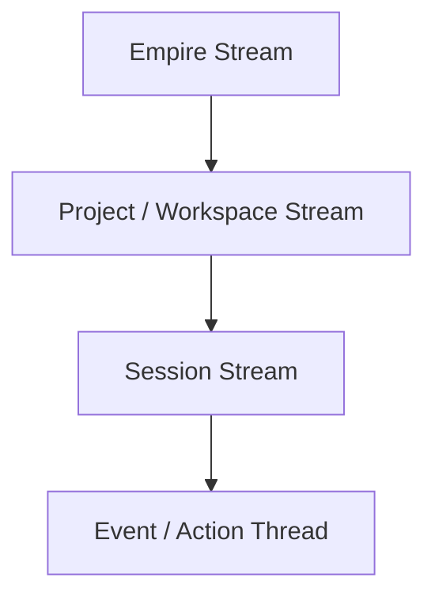
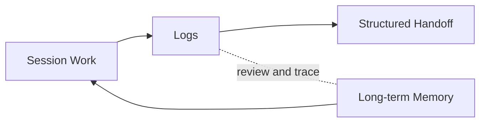
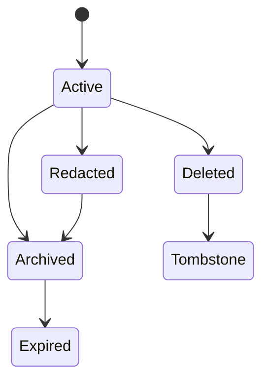

# Log Model

This document defines how PAOS records ground-truth history for audit, reconstruction, review, and continuity.

## Core Position

- Logs are a **hybrid event + transcript** system.
- Logs are **separate from memory**.
- Logs are the historical truth for what happened.
- Long-term memory remains the reusable intelligence layer.

## Log Streams

| Stream | Purpose |
| --- | --- |
| `Empire` | Global operational and governance history |
| `Project / workspace` | Scoped history for a project or workspace |
| `Session` | The active conversation and action timeline |
| `Event / action thread` | Fine-grained continuity for one task, approval flow, or sequence |

## Stream Layout

## Event Families

| Family | What It Captures |
| --- | --- |
| `Conversation` | Message-level chat history with thread links |
| `Action` | Tool use, system actions, and execution steps |
| `Approval` | Permission requests, decisions, and denials |
| `Memory` | Memory proposals, approvals, archival changes, and purges |
| `Rollover` | Checkpoints, handoffs, and context-continuity events |

Denied, blocked, and failed operations should always be logged as first-class events.

## Record Shape

PAOS should use a common log envelope plus a family-specific payload.

| Common field | Purpose |
| --- | --- |
| `log_id` | Stable identifier for the record |
| `timestamp` | When the event happened |
| `scope` | Empire, project, session, or thread scope |
| `family` | Event family |
| `actor` | Who initiated or performed the event |
| `outcome` | Success, denied, blocked, failed, or other result |
| `correlation_id` | Groups related events into one operation |
| `thread_id` | Links the event to one conversational or action thread |
| `refs` | Related memory, artifact, log, or action references |

Relevant records should include provider/model execution metadata with bounded raw payloads rather than full unrestricted dumps.

## Access Model

| Viewer | Default access |
| --- | --- |
| `CEO` | Full direct read access |
| `COO` and internal roles | Need-to-read access based on scope and authority |
| `Knowledge Lead` | Scoped log review for handoffs and memory shaping |
| `Security Lead` | Audit, investigation, and removal execution authority |

## Logs In The System

## Retention And Removal

- Logs are **append-only**.
- Corrections, redactions, and removals should create new records rather than silently rewriting history.
- Manual removal is **CEO-directed** and **Security-executed**.
- Manual removal should leave a **tombstone** in historical review.
- Default retention is **no silent expiry**.
- The CEO may later configure log-retention policies explicitly.
- Logs should move out of the active view after **closure + age threshold**.

## Change Lifecycle

## Why This Matters

This model keeps the system trustworthy:
- memory can stay curated,
- logs can stay auditable,
- and rollovers, approvals, failures, and removals can still be reconstructed later.
