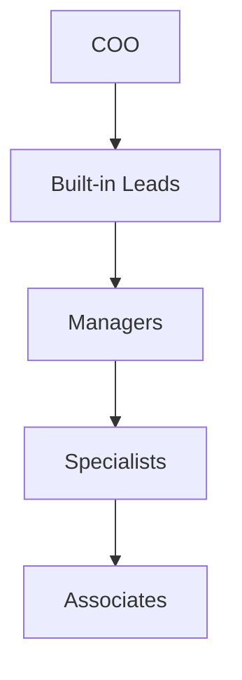

# Organization

This domain defines the internal company structure of PAOS: fixed backbone roles, hierarchy rules, and the company ladder future custom agents should fit into.

## Documents

| Document | Purpose | Status |
| --- | --- | --- |
| [Role Hierarchy](role-hierarchy.md) | Built-in departments, rank ladder, and branching rules | Planned |

## Structure View

