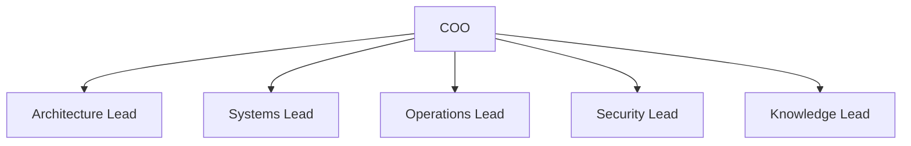
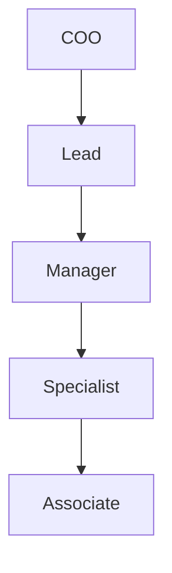

# Role Hierarchy

This document defines the baseline internal organization that exists under the COO.

## Fixed Backbone

PAOS starts with a fixed company backbone of one COO and five built-in leads:

| Title | Function |
| --- | --- |
| `COO` | Main interface, orchestration, delegation, and final operational coordination |
| `Architecture Lead` | Designs hierarchy, agents, reporting lines, and configuration structures |
| `Systems Lead` | Manages workspace files, local system actions, and tool-facing operations |
| `Operations Lead` | Runs delegated tasks, workflows, and execution sequences |
| `Security Lead` | Enforces permissions, approvals, overrides, and audit policy |
| `Knowledge Lead` | Owns memory structure, retrieval, summarization, and durable memory proposals |

## Org Chart



## Hierarchy Rules

- Built-in titles are fixed.
- Built-in AI names and descriptions are editable.
- Future custom agents should have **one primary parent**.
- Cross-branch communication should be **denied by default** unless an approved link exists.
- The COO should always be able to observe, interrupt, or override cross-branch activity.

## Default Ladder

The baseline rank ladder below the COO is:

```text
COO -> Lead -> Manager -> Specialist -> Associate
```

This ladder gives the empire a company-shaped structure without allowing the org chart to become visually or operationally vague.

## Visual Ladder



## Intended Use

- Built-in leads represent the product baseline.
- Custom agents should inherit the same company framing through title and parentage.
- A custom agent can be specialized narrowly, such as a network-limited research agent, without becoming a new top-level built-in department.

## Baseline Constraint

The hierarchy should have a hard depth cap at the baseline ladder shown above. This preserves clarity in permissions, org visualization, and future debugging.
