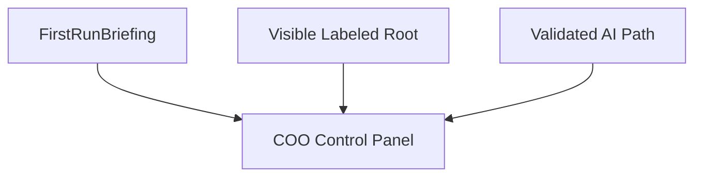

# Onboarding Baseline

This document defines the first-run setup required before PAOS becomes usable. It keeps onboarding minimal, guided, and secure while leaving deeper customization for later settings.

## Core Position

- Onboarding should use a **guided step sequence**.
- Onboarding should require only the **baseline essentials**.
- Entry stays blocked until the baseline essentials are complete.
- Onboarding should not create starter projects or sample content.
- Richer personalization should be learned over time, not forced during first launch.

## Required Setup

The onboarding gate should require these items and nothing broader:

| Required item | Purpose |
| --- | --- |
| `EmpireRootSelection` | Choose or create the empire root |
| `CEOIdentity` | Set the CEO's visible name |
| `EmpireIdentity` | Set the empire name |
| `COOIdentity` | Set the COO name |
| `InitialAIPath` | Configure one usable local or hosted AI path |
| `OnboardingCheckpoint` | Confirm each required step is complete enough to continue |

`InitialAIPath` should include at least:
- mode: `local` or `hosted`
- provider or model path
- validation result
- setup or audit reference

## Guided Flow

The onboarding flow should progress in this order:

1. Choose or create `EmpireRoot`
2. Set `CEO` name
3. Set `Empire` name
4. Set `COO` name
5. Configure one `InitialAIPath`
6. Run a basic validation check
7. Enter PAOS through the `COO control panel`

## Onboarding Flow

## AI Path Setup

The AI step should be one unified setup step where the CEO chooses either:
- one hosted provider
- or one local model path

Both choices should be supported from the same step rather than through separate onboarding tracks.

The validation should be a **basic connectivity check**, enough to confirm the COO can operate after setup without turning onboarding into a full diagnostic flow.

## Security Introduction

Onboarding should explain that PAOS starts:
- sandboxed
- deny-by-default
- secure by baseline

It should not ask the CEO to choose a complex security mode during onboarding. Advanced policy tuning belongs in later settings after entry.

Choosing the empire root during onboarding should bootstrap the standard root layout there, but project creation itself is not part of onboarding.

## First Entry Experience

After onboarding, the CEO should land in the **COO control panel**.

The first-entry experience should include:
- a visible summary of the configured empire root
- the chosen initial AI path
- a short `FirstRunBriefing`
- a reminder that baseline security is active

The standard root structure should be visible and labeled:
- `/projects`
- `/system`
- `/logs`
- `/memory`
- `/mounts`

Once the baseline essentials are complete, entry is allowed. Non-essential future setup belongs in settings, not inside the onboarding gate.

## First Entry View

## Why This Matters

This model gives PAOS a usable first launch without diluting the secure baseline:
- the empire gets a real local home
- the CEO and COO gain a clear initial identity
- PAOS becomes usable immediately through one validated AI path
- and the product avoids turning first-run setup into a heavy wizard
