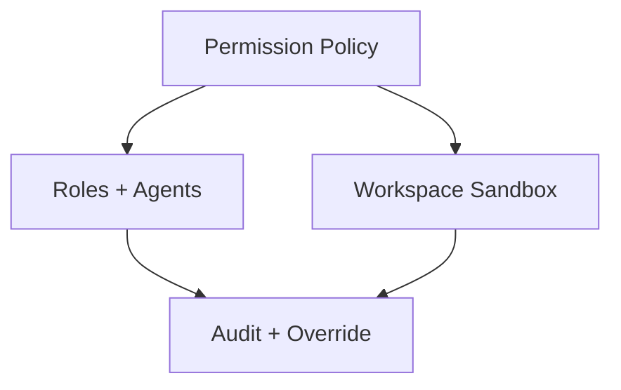

# Security

This domain will hold the protection model for PAOS: permission inheritance, sandbox boundaries, approvals, and exceptional access rules.

## Documents

| Document | Purpose | Status |
| --- | --- | --- |
| Global permission model | Empire-wide safety caps and role permission inheritance | Next |
| Workspace and sandbox model | Filesystem, tool, and network boundary rules | Next |

## Security Focus

