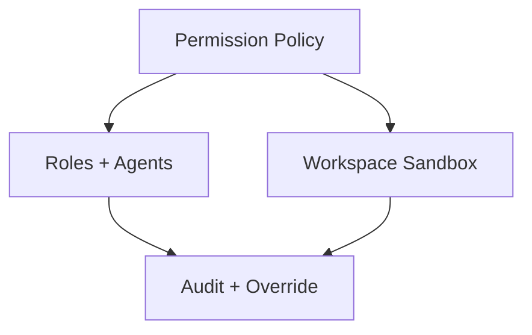

# Security

This domain will hold the protection model for PAOS: permission inheritance, sandbox boundaries, approvals, and exceptional access rules.

## Documents

| Document | Purpose | Status |
| --- | --- | --- |
| [Global permission model](global-permission-model.md) | Empire-wide safety caps, role inheritance, approvals, and overrides | Planned |
| [Workspace and sandbox model](workspace-and-sandbox-model.md) | Empire root, mounts, tool execution, and network boundary rules | Planned |

## Reading Order
1. [Global permission model](global-permission-model.md)
2. [Workspace and sandbox model](workspace-and-sandbox-model.md)

## Security Focus

