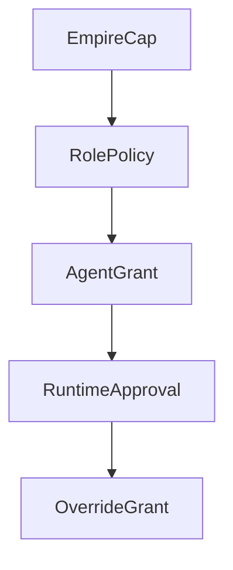
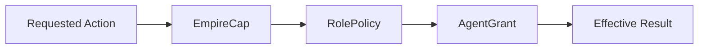
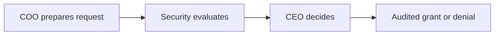

# Global Permission Model

This document defines the baseline permission framework for PAOS: what can be granted, how permissions inherit, and how approval-driven elevation works without weakening the secure baseline.

## Core Position

- PAOS is **deny by default**.
- PAOS should **prompt only within empire caps**.
- Requests that exceed empire caps are **hard-denied** until the CEO changes policy.
- The CEO is the **only authority** that can change empire-wide safety caps.
- Lower permission layers can narrow access, but they cannot exceed the layer above them.

## Permission Layers

| Layer | Purpose |
| --- | --- |
| `EmpireCap` | Highest allowed boundary for the empire |
| `RolePolicy` | Default policy for a built-in or future role |
| `AgentGrant` | Active permission set for a specific AI instance |
| `RuntimeApproval` | One-time, session, or durable grant created through approval |
| `OverrideGrant` | Temporary exception within empire caps only |

## Permission Stack

## Capability Families

Permissions are grouped into explicit capability families and then narrowed with typed constraints.

| Capability | Purpose |
| --- | --- |
| `workspace.read` | Read inside the PAOS workspace boundary |
| `workspace.write` | Write inside the PAOS workspace boundary |
| `external_files.read` | Read outside the PAOS workspace boundary |
| `external_files.write` | Write outside the PAOS workspace boundary |
| `network.access` | Reach remote network targets |
| `tools.execute` | Execute tools or operational actions |
| `memory.access` | Read or shape memory under the memory-governance rules |
| `communication.access` | Communicate across roles or branches |
| `provider.local` | Use local AI backends |
| `provider.hosted` | Use hosted AI providers |

Typed constraints should be allowed to target:
- paths
- projects or workspaces
- domains
- providers
- roles
- communication links

## Policy Resolution

- Highest boundary wins.
- `EmpireCap` is the top boundary.
- A child agent inherits its parent branch's maximum envelope, but starts from a smaller active policy.
- Widening a child agent must be explicit and cannot exceed the inherited bound.
- Within the same layer, `deny` beats `approval-required`, and `approval-required` beats `allow`.
- Durable grants are written by Security after CEO approval.

## Resolution Logic

## Approval Flow

| Stage | Owner |
| --- | --- |
| Request preparation | `COO` |
| Risk and policy evaluation | `Security Lead` |
| Final approval decision | `CEO` |
| Durable policy write | `Security Lead` |

Approval may persist as:
- `one-time`
- `session`
- `policy grant`

Overrides are:
- temporary only
- valid only within empire caps
- never auto-converted into durable policy grants

## Approval Path

## Built-in Role Matrix

Status legend:
- `Allowed`
- `Approval`
- `Denied`

| Role | workspace.read | workspace.write | external files | network | tools | memory | communication | provider.local | provider.hosted |
| --- | --- | --- | --- | --- | --- | --- | --- | --- | --- |
| `COO` | Allowed | Approval | Denied | Approval | Denied | Allowed | Allowed | Allowed | Allowed |
| `Architecture Lead` | Allowed | Approval | Denied | Denied | Denied | Allowed | Allowed | Allowed | Allowed |
| `Systems Lead` | Allowed | Allowed | Approval | Denied | Approval | Approval | Allowed | Allowed | Allowed |
| `Operations Lead` | Allowed | Approval | Denied | Approval | Approval | Allowed | Allowed | Allowed | Allowed |
| `Security Lead` | Allowed | Denied | Denied | Denied | Denied | Allowed | Allowed | Allowed | Allowed |
| `Knowledge Lead` | Allowed | Denied | Denied | Denied | Denied | Allowed | Allowed | Allowed | Allowed |

These are baseline role defaults, not permanent limits. The CEO may tune them within empire caps.

## Policy Shape

The lightweight policy model should carry at least these fields:

| Field | Purpose |
| --- | --- |
| `capability` | Which capability family the rule controls |
| `outcome` | `allow`, `approval-required`, or `deny` |
| `scope_constraint` | Path, project, domain, provider, role, or communication boundary |
| `source_layer` | Which layer defined the rule |
| `persistence` | One-time, session, durable, or temporary override |
| `actor` / `approver` | Who proposed and who approved the rule |
| `audit_ref` | Link to the logged policy event |

## Why This Matters

This model keeps PAOS secure without turning the system into a maze:
- the CEO controls the highest boundary
- roles inherit structure without inheriting accidental power
- approvals can elevate safely within caps
- and every durable permission change remains explainable and auditable
