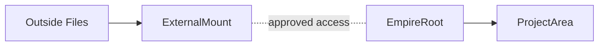
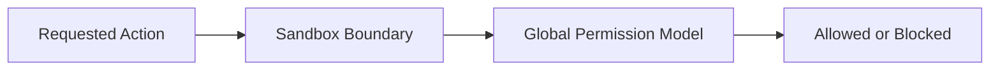

# Workspace And Sandbox Model

This document defines the local operating boundary for PAOS: where the empire lives, what counts as inside or outside the sandbox, and how files, tools, and network access are contained.

## Core Position

- PAOS operates inside one chosen **empire root**.
- The empire root is the normal safe local operating space.
- Anything outside the empire root is blocked unless explicitly mounted or otherwise granted.
- Network access is off by default.
- External execution is a real security boundary, not just a UX label.

## Empire Root

| Concept | Meaning |
| --- | --- |
| `EmpireRoot` | The top-level local directory chosen for the PAOS empire |
| `ProjectArea` | The normal home for PAOS-managed projects inside the empire root |
| `SystemArea` | PAOS-managed internal areas that remain visible but protected |

PAOS-managed projects should live inside `/projects`. Outside folders do not become normal project space unless a future import flow explicitly moves them inside the empire root.

## Root Layout

The standard empire-root layout should be:

| Path | Purpose |
| --- | --- |
| `/projects` | PAOS-managed project work |
| `/system` | PAOS-managed internal state |
| `/logs` | Log and audit artifacts |
| `/memory` | Memory artifacts and related state |
| `/mounts` | Metadata for approved external mounts |

The root layout should be visible to the CEO and clearly labeled so project-facing and PAOS-managed areas are not confused.

## Empire Layout

```mermaid
flowchart TD
    Root[EmpireRoot]
    Root --> Projects[/projects]
    Root --> System[/system]
    Root --> Logs[/logs]
    Root --> Memory[/memory]
    Root --> Mounts[/mounts]
```

## External Mounts

Outside access should use explicit **external mounts**.

| Concept | Meaning |
| --- | --- |
| `ExternalMount` | An approved external path outside the empire root |
| `access_level` | The granted read/write level for that mount |
| `persistence` | Whether the mount remains as durable policy |

Baseline mount rules:
- mounts are durable policy objects
- mounts are external references, not mirrored into the empire root
- mounts are read-only by default
- removing a mount detaches access only
- removing a mount never moves or deletes outside files

`ExternalMount` should carry at least:
- target path
- access level
- persistence
- owner / approver
- audit reference

## Boundary View



## Tool Execution Boundary

PAOS-native internal actions stay native and do not count as external tool execution.

External execution includes:
- shell commands
- scripts
- runtimes
- launched external applications

Baseline tool rules:
- external tools must be registered with policy
- approved tools may execute only against the current workspace scope or an explicitly mounted scope they are allowed to touch
- tool execution is separate from ordinary file access and must be permitted by both policy and sandbox scope

`RegisteredTool` should carry at least:
- tool identity
- runtime type
- allowed execution scope
- file scope
- network scope
- audit reference

## Network Boundary

- Network access is off by default.
- Access is granted through domain or service allowlists.
- Hosted providers are explicit approved service endpoints, not general internet exceptions.
- Local providers remain separate from hosted providers.

| Concept | Meaning |
| --- | --- |
| `NetworkAllowlist` | Approved domains, hosts, or service endpoints |
| `ExecutionScope` | The active workspace or mounted area a tool or operation may act inside |

## Protected Areas

System-owned areas remain visible but protected.

- The CEO may inspect them.
- Ordinary role actions do not casually modify them without the proper scoped grant.
- The sandbox enforces location and execution boundaries.
- The global permission model decides whether a role or agent may act inside those boundaries.
- Both the sandbox and the permission system must allow an action for it to proceed.

## Enforcement Model



## Why This Matters

This model gives PAOS a clear secure baseline:
- one understandable local home for the empire
- outside access that is explicit instead of fuzzy
- external execution that is genuinely bounded
- and network behavior that stays opt-in rather than silently open
