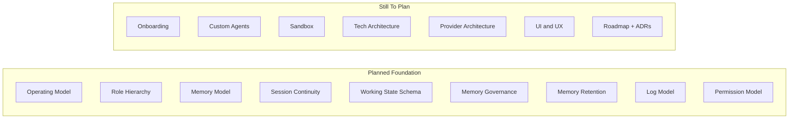

# Planning Status

This file tracks which planning areas are stable enough to document and which areas still need design work before implementation starts.

## Completed Planning Areas

| Section | Status | Notes |
| --- | --- | --- |
| Operating model | Planned | CEO/COO relationship and AI identity model are defined. |
| Role hierarchy | Planned | Built-in backbone, titles, branching, and depth ladder are defined. |
| Memory model | Planned | Memory layers, logs boundary, and memory commit path are defined. |
| Session continuity | Planned | Context overflow is handled through structured handoff and automatic rollover. |
| Working state schema | Planned | The session state and handoff records are typed and traceable. |
| Memory governance | Planned | Read/write rules, overrides, and authority flow are defined. |
| Memory retention | Planned | Superseding, archive behavior, and purge rules are defined. |
| Log model | Planned | Layered hybrid logs, access rules, retention, and removal behavior are defined. |
| Global permission model | Planned | Deny-by-default permission layers, approval flow, and role policy defaults are defined. |

## Still Needed

### Security

| Section | Why It Matters |
| --- | --- |
| Workspace and sandbox model | Needed to define local boundaries, filesystem rules, tool execution, and internet access. |

### Product Setup

| Section | Why It Matters |
| --- | --- |
| Onboarding baseline | Needed to define the first-run setup flow for workspace, providers, names, and security posture. |

### Empire Building

| Section | Why It Matters |
| --- | --- |
| Custom agent creation model | Needed to define how the user creates new agents, assigns parents, titles, links, and permissions. |

### Architecture

| Section | Why It Matters |
| --- | --- |
| Tech architecture | Needed to finalize stack, storage choices, key handling, packaging, and cross-platform delivery. |
| Provider architecture | Needed to define how OpenAI, Ollama, Gemini, Claude, and future providers plug in. |
| UI/UX structure | Needed to define control panel, org chart, approvals, memory inspector, and audit views. |
| Roadmap and ADR package | Needed to turn planning into buildable implementation phases and decision records. |

## Visual Status

## Immediate Next Recommendation

The next document to design should be the **workspace and sandbox model**. The permission framework now needs concrete filesystem, tool, and network boundary rules so the secure baseline becomes operational.
